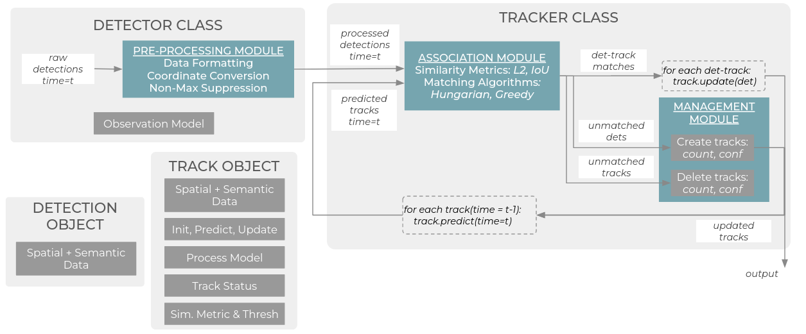

# MaRMOT
Modular and Reconfigurable Multiple Object Tracking (MaRMOT) framework for robots and intelligent systems in ROS2. MaRMOT is designed to be fast and accurate enough for real-time applications, modular, reconfigurable, and capable of running on embedded hardware.

MaRMOT was submitted to the 33rd IEEE International Conference on Robot and Human Interactive Communication (IEEE RO-MAN 2024).

This package is under active development as part of my Ph.D. in robotics at UT Austin--if there is a feature you would like to see, please [contact me](mailto:john.a.duncan@utexas.edu) or raise an issue!


# About


MaRMOT is an open-source ROS2 implementation of the Tracking-by-Detection paradigm, used by many common trackers with deep learning-based LiDAR and vision detectors. However, MaRMOT can be extended for an arbitrary detector type. 

There are a few key components to know:
- Track and Detection objects, implemented in `marmot/datatypes.py`
- Detection pre-processing, implemented in the `/src/*_preproc.cpp` files. This converts an arbitrary detectionfrom one ROS2 message type into the MaRMOT `tracking_msgs/Detections3D.msg` format for processing by the tracker node.
- The tracker node, implemented in `marmot/tracker.py`. It inherits the `marmot/assignment.py` and `marmot/management.py` modules, and publishes `tracking_msgs/Tracks3D.msg` objects for general tracking use and Foxglove `foxglove_msgs/SceneUpdate.msg` messages for visualization in Foxglove Studio.

Supporting file types include:
- ROS2 `/launch` files, which start the nodes, specify configuration files, and play back data as needed.
- `/config` files, which specify the tracker parameters, detector parameters, and object parameters.

# Usage

## Installation and Setup
To install MaRMOT, follow the [installation instructions](docs/INSTALL.md).

## Running nuScenes experiments
During development, we used the nuScenes tracking development kit for tuning and evaluation. The results are reported in our 2024 paper.

If interested in using nuScenes for tracker development, see the [nuScenes instructions](docs/NUSCENES.md).

## Running MoCap experiments
If interested in recreating the MoCap experiment results from the 2024 paper, see the [MoCap instructions](docs/MOCAP.md).

## Running the OAK-D demo
After completing the [installation instructions](docs/INSTALL.md), if you have a Luxonis OAK-D camera you can use the included files to run MaRMOT with an OAK-D detector.
```
cd ~/tracking_ws
conda activate marmot
source install/setup.bash
ros2 launch marmot oakd_demo.launch.py
```
Now in a separate window, open up `foxglove-studio` to visualize.
```
foxglove-studio
```
Then, connect to the default connection at `ws://localhost:8765` to view live tracker data.

# Development
If interested in adding a new model, method, or feature (or if the existing code could be better modified for your purposes) please see the [development instructions](docs/DEVEL.md),raise an issue, or [contact me](mailto:john.a.duncan@utexas.edu).

# Acknowledgements
The nuScenes `.mcap` conversion script is a modified version of the original from Foxglove, available [here](https://github.com/foxglove/nuscenes2mcap). While the original Foxglove version uses protobuf serialization, the [included file](scripts/nuscenes/nuscenes_to_mcap.py) uses Foxglove's ROS2 serialization, with the same datatypes. 

The [tracking evaluation script](scripts/evaluate.py) is copied from Nutonomy's nuScenes devkit repo [here](https://github.com/nutonomy/nuscenes-devkit/tree/master/python-sdk/nuscenes/eval/tracking) for convenience.

MaRMOT uses a modified version of Weng et al's AB3DMOT greedy matching algorithm, found [here](https://github.com/xinshuoweng/AB3DMOT/blob/master/AB3DMOT_libs/matching.py).

MaRMOT uses [PyTorch3D](https://pytorch3d.org/docs/iou3d) to compute 3D Intersection-over-Union (IoU).
# Potential Improvements
## Usability
- Docker/containerized version
## Readability
- Move detector initialization to separate class
- Move process models to separate class
- Move yaw correction to separate utility class
